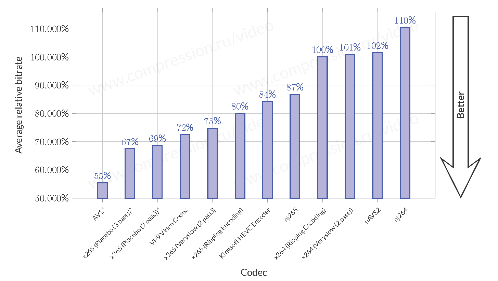

FFmpeg 引言
================

FFmpeg 是一个强大的命令行音视频工具，可以承担转码、混流、嵌挂字幕、剪辑等工作。

本章介绍安装与一些视频的基本概念。

安装
----

*本小节的内容以 Windows 用户为例。*

前往 FFmpeg 官网建议的 `Windows 版本的已编译文件 (gyan.dev) <https://www.gyan.dev/ffmpeg/builds/#release-builds>`_ 进行下载，或者在 `FFmpeg 官网下载页 <https://ffmpeg.org/download.html#build-windows>`_ 选择其他编译版本。我一般在下载时选择 release 版本、 标记组件为 full 的版本进行下载。

下载完成后，将内容解压到你的硬盘某处，例如：\ ``C:\FFmpeg``\ 。如果之前安装过独立的 FFmpeg，可以覆盖到老版本的文件夹。之后，将安装路径添加到系统的 Path 环境变量。

最后，检查是否能从命令行正常启动。打开 PowerShell，输入：

.. code:: shell

   ffmpeg

来查看返回的版本号是否与你下载的一致。

-  如果你的电脑上安装了多个 FFmpeg（有时候其他软件会安装 FFmpeg 作为基础组件，比如 ImageMagick），可以通过 ``(Get-Command ffmpeg).source`` 来查看被调用的 FFmpeg 路径，以确认是否调用了希望调用的 FFmpeg。
-  如果 ``ffmpeg`` 命令调用了别处的 FFmpeg，你可以考虑将刚安装的 FFmpeg 的路径移动到 Path 环境变量列表中的靠前的位置，使 Windows 在查找设备上的 FFmpeg 时优先寻到这个版本。

基本视频概念
------------

在介绍 FFmpeg 的工作命令之前，我们首先对视频文件内部的一些概念做一个通俗的说明。注意： *以下的说明可能存在不准确之处，仅作大致理解用* 。

- **流**\ （stream）：通常的视频文件中最易见的是视频流与音频流两个流。部分视频文件（多为 mkv 文件）还有字幕流，即内挂字幕。注意，有的视频将字幕嵌入到了视频流中（内嵌字幕），这类视频没有字幕流，也无法提取出字幕文件。至于数据流，本文不作介绍。

   - **码率/比特率**\ （bitrate）：衡量流的数据量的标准。高码率的视频、音频携带了比低码率更多的数据，在压制时（允许的）损失较小，因此它们的质量一般更高。例如，128 kbps 的 MP3 音频的听感效果一般比 64 kbps 的好。
   - **分流/混流**\ （mux/demux）：将多个流从一个视频文件中对应地抽取出来，称为分流。反之，将多个流整理后写入某个文件，称为混流。
   - **容器**\ （container）：可以粗略地理解为某种扩展名类型的视频文件。比如 MP4 是一种容器，MKV 是另一种容器。

- **编码/解码**\ （encode/decode）：将流用某种格式或规范记录下来并存储，称为编码；将编码后的流，根据格式或规范来逆向实现编码的过程，从而将流还原出来，称为解码。我们最经常听到的规范大概是 H.264，最常见到的编码器可能是 libx264。

色深与色度采样
^^^^^^^^^^^^^^^^^^

在很长的一段时间内，8 bit 色深、4:2:0 色度采样是最常见的视频像素格式。

* **色深位**\ （bit）：该概念与图片中颜色分级的位概念一致。在很长一段时间内，最广泛使用的颜色分级会把纯黑到纯白的灰阶分成 256 级，因此叫 8 位（因为 :math:`2^8=256`\ ）色深。8 bit 的视频也是最广为使用的。我们预期 10 bit 将继任；但目前 10 bit（甚至更高）色深主要在录制设备上应用，而在播放设备（显示屏等）上的普及尚远。

* **色度采样**\ （chroma sampling）：视频在录制或编码时，我们常逐个记录像素的明度、而采样式地（非逐个）记录像素的色度，以此减小视频大小。这种方式称为 YCrCb，其中 Y 表示明度，Cr 与 Cb 用于记录色度（红色与蓝色的偏移量）。
   
  色度采样方式常常使用 x:y:z 的方式来表示，如 4:2:0。这种记法表示在 4 个像素宽、2像素高的区域中，每行对 x 个像素进行亮度采样。x 通常是 4，也就是全像素亮度记录。而 y 与 z 分别代表第一行与第二行的采样数。例如，4:2:2 表示在两行中均只对 2 个像素采样色度（剩余像素的色度由采样速度推断），因此实际只使用了这 8 个像素中 4 个像素的色度信息，即丢失了 50% 的色度。同理，4:2:0 在第一行对 2 像素色度采样、不在第二行色度采样，因此丢失了 75% 的色度信息。最后，4:4:4 表示对全像素记录色度。

在 FFmpeg 中，可以使用 ``ffmpg -pix_fmts`` 来查看 FFmpeg 支持的所有像素格式。

.. _codec_format:

常用的编码格式
---------------

FFmpeg 支持基本所有的主流编码格式。

常用的视频编码格式有：

* :encode:`H.264` 是上一代最广为使用的视频编码格式，始于 2003 年，当之无愧的一代霸主。在 FFmpeg 中可由 ``libx264`` 编码器支持。
* :encode:`H.265` （或称 HEVC） 是 H.264 的接任者，于 2013 年正式面世。它在同等视频质量下提供了相比 H.264 而言可达 50% 的体积缩减。 ``libx265`` 编码器对该编码格式提供了支持。
* :encode:`VP9` 经历了从 VP3 起漫长的版本迭代，VP 系列解码器的开发公司 On2 被谷歌收购。谷歌在 2013 年左右推出了取代上一代 VP8 编码的 VP9，主要为旗下的互联网视频平台 Youtube 所采用。 
* :encode:`AV1` (AOMedia Video 1) 是 H.265 的免版税竞争者，极大地基于 VP9 的技术，并在 VP9 的基础上提供了惊人的压缩比率。其开发联盟由诸多互联网公司支持，并受到主流浏览器 Chrome 与 Firefox 的积极推动。它在 FFmpeg 中由 ``libaom-av1`` 编码器对该编码格式提供支持。

   
   AV1、x265、VP9 等主流编码器的平均压缩比。
   
图源: CS MSU Graphics & Media Lab, Video Group. MSU Codec Comparison 2017 Part V: High Quality Encoders. 2018. p19.（点击图片跳转）

常用的音频编码格式有：

* :encode:`MP3` 时至今日仍最流行的有损编码格式。编码器 ``libmp3lame``\ 。
* :encode:`AAC` 是 MP3 的接任者，常常作为视频容器 MKV 选用的音频格式，而其作为音频时的容器则通常是是 m4a。编码器有 FFmpeg 原生提供的、针对低码率音频（AAC LC）的 ``aac`` 编码器；此外，需要制作高质量 AAC 时（HE-AAC）可以使用 ``libfdk_aac`` 编码器。
* AC3 杜比数字格式，编码器 ``ac3`` (Dolby Digital) 或者 ``eac3`` (Dolby Digital Plus)。
* FLAC 是较常用的无损音频格式；FFmpeg 对其有原生的编码器 ``flac`` 支持。
* PCM 是 WAV 容器内包含的最常见音频编码格式。FFmpeg 默认使用 ``pcm_s16le`` 编码器来处理 PCM 输出。关于这部分的内容，读者可以参考 `PCM 格式 <https://trac.ffmpeg.org/wiki/audio%20types>`_ 页面。
