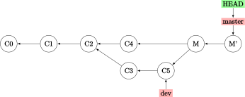

.. _advanced-conflict:

高级合并与冲突处理
====================

本章介绍如何应对合并分支时的冲突。

中断合并
--------------------

当一次合并操作出现问题，你可以使用 `--abort` 选项中断合并：

.. code-block:: sh
   
   $ git merge --abort

该操作会恢复到你合并前的状态——如果你合并前的目录没有未提交、未提交的修改，它可能出现问题；此外的情形它总是可靠的。

忽略空白符变更
-----------------

如果要合并的文件有空白的问题（比如将制表符格式化为空格）,可以使用 `-Xignore-all-space` （忽略已有空白处的空白修改） 或 `-Xignore-space-change` （忽略所有空白修改）。

手动合并文件
-----------------

这里需要一个特别的 `git show` 命令，可以将同一文件的不同版本保存到当前目录：

.. code-block:: sh
   
   $ git show :1:hello.md > hello-ancestor.md
   $ git show :2:hello.md > hello-current.md
   $ git show :3:hello.md > hello-branch.md

其中，数字 1~3 分别表示共同祖先、当前分支、要合并的分支。然后，使用罕用的 `merge-file` 命令来合并它们：

.. code-block:: sh
   
   # ... 做一些修改 ...
   $ git merge-file -p \
       hello-ancestor.md hello-current.md hello-branch.md > hello.md

完成了合并后，可以通过以下命令查看修改的内容：

.. code-block:: sh
   
   $ git diff --ours    # 合并与当前分支文件的不同
   $ git diff --theirs  # 合并与要合并的分支文件的不同
   $ git diff --base    # 合并怎样改动了共同祖先

选项 `-b` 可以忽略空白变更的修改。

最后，新创建的三个 md 文件都没有用了，我们可以用 `clean` 命令清除：

.. code-block:: sh
   
   $ git clean -f
   Removing hello-ancestor.md
   Removing hello-current.md
   Removing hello-branch.md

检出冲突
-------------

当 `merge` 命令检查到冲突时，文件中会有类似这样的片段（摘自官方手册）：

.. code-block::
   
   def hello
   <<<<<<< HEAD
   puts 'hola world'
   =======
   puts 'hello mundo'
   >>>>>>> mundo
   end

我们在 :ref:`basic-conflict` 中已经介绍过，"<" 与 "=" 之间是当前分支的内容，而 "=" 与 ">" 之间是待合并分支的内容。可有时你并不清楚应当采用哪个版本，因此你希望查看它们的共同祖先的内容。使用 `--conflict=diff3` （默认是 `=merge` ） 会重新生成冲突片段，但添加共同祖先内容在中间：

.. code-block:: sh
   
   $ git checkout --conflict=diff3 hello.rb
   ...
   def hello
   <<<<<<< ours
   puts 'hola world'
   ||||||| base
   puts 'hello world'
   =======
   puts 'hello mundo'
   >>>>>>> theirs
   end

这样你就清楚地知道，共同祖先使用的是 "hello world"，与两者都不一样。如果你偏好这种格式，可以让 git 把合并冲突的默认格式设置成 `diff3` 模式：

.. code-block:: sh
   
   $ git config --global merge.conflictstyle diff 

`checkout` 命令也有 `--ours` 与 `--theirs` 选项，用以选择对应提交的版本而抛弃另一个提交的版本。这是一种无需合并的快速方式，尤其是对二进制文件的版本控制而言。

查询日志
-------------

合并冲突有时需要借助日志来解决，尝试：

.. code-block:: sh
   
   # 显示两个分支在共同祖先之后的提交
   $ git log --oneline --left-right HEAD...MERGE_HEAD
   # 显示两个分支中与冲突文件相关的提交
   $ git log --oneline --left-right --merge

.. _revert-merge-commit:

撤销合并提交
----------------

假如你错误地进行了合并，尚未进行新的更改。那么可以使用：

.. code-block:: sh
   
   $ git reset --hard HEAD~

这是因为 HEAD 分支指向 master 上的合并提交，向前回退到父提交则是移动 HEAD 到 master 合并前的那个版本。至于并入的分支的指针，它并没有移动过。

**如果你的仓库已经推送到远程，那么上述方法是不合适的** ；请记住，`reset` 命令会更改日志，在共享工作流中需要避免。这时的替代方案是 `revert` 命令：

.. code-block:: sh
   
   $ git revert -m 1 HEAD

选项 `-m 1` 表示保留该合并提交的第一父提交（对于将其他分支合并到 master 分支的情形，即指位于 master 分支的父提交）。尚未完成的合并提交中，第一父提交是 HEAD，第二父提交是并入分支（假设叫 dev）的最新提交。上述命令会撤销从第二父提交中引入的更改，同时保留第一父提交中的所有内容。注意：本命令实质上在合并提交 `M` 后**新建**了一个提交 `M'`，但 `M` 仍然被保留在了日志中。

这里 M' 实质与 C4 的快照相同。

这样做的问题是，如果你再尝试合并，git 不会响应你的请求：

.. code-block:: sh
   
   $ git merge dev
   Already up-to-date.

也就是 C5 并不能和 M' 合并；因为 C5 已经可以由 M' 回溯到达，git 认为没有合并可以做。更不妙的是，假如你在 dev 分支又更新了内容（提交 C6），请**不要**与 M' 直接合并，否则 C3 与 C5 这两个位于上一次合并之前的更改不会被加入这次合并（而上一次合并，也就是 M，实质上又被 M' 遮盖了），你就会在这次合并后发现 C3 与 C5 的内容并没有被加入到新的合并提交中去。

解决方法是利用 `revert` 命令，将 M' 再反转回去，“恢复” M 这个合并提交（因为 M 是包含 C3 与 C5 内容的），之后再进行合并：

.. code-block:: sh
   
   $ git revert   # revert M'
   $ git merge dev

这样新建的 M'' 提交实质上等同于之前的合并提交 M。 

.. image:: pics/branch-revert-2.svg
   :width: 80%
   :align: center

压缩合并
----------------

有时你的开发分支 dev 可能会充满无意义的提交与不清晰的历史（虽然我建议你尽量避免这种情形），因此向主分支 master 合并时可能会不想保留这些记录。那么压缩合并 `--squash` 正是你的救星。

.. important:: 
   
   压缩合并并不是真的合并了分支，它只是将待合并分支的改动复制到了当前分支，从而允许用户将待合并分支的众多提交“压缩”成当前分支的单个提交。

.. code-block:: sh
   
   $ git merge --squash dev
   $ git commit -m "Update ..."

注意到在上述操作之后，dev 分支并没有真的被合并到 master 分支。如果 dev 分支仍在将来会被合并，不可避免地，你将把它之上的提交历史也合并到 master 分支。因此，我建议只对临时本地分支使用压缩合并，并在压缩合并后删除该分支。

偏好合并
----------------

如果你预计合并中会出现冲突，但你只要求 master 分支的内容覆盖 dev 分支的内容，你可以使用 `-Xours` 选项：

.. code-block:: sh
   
   $ git merge -Xours dev

正如上文提及的，“ours” 指代当前分支，“theirs” 指代待合并分支。因此你也可以类似地使用 `-Xtheirs` 选项。多说一句，这两个选项对于较少用到的 `merge-file` 命令也生效。

伪合并\*
-------------

伪合并（fake merge）是指一种欺骗 git 创建合并提交的方式。它使用 `-s` 选项，指定一个伪合并策略（通常是 `ours` ）：

.. code-block:: sh
   
   $ git merge -s ours dev

作用是将当前分支的最新提交直接复制为这个合并提交（即它完全不管来自 dev 的最新提交是什么），合并后可以发现 `HEAD` 与 `HEAD~` 完全相同。例如，你的 bugfix 分支解决了一个 master 分支的问题。考虑到你的开发分支 dev 尚不能向 master 合并，你需要做的是：

.. code-block:: sh
   
   $ git checkout master
   $ git merge -s ours bugfix
   $ git checkout dev
   $ git merge bugfix
   ...
   $ git branch -d bugfix

向 master 分支伪合并 bugfix 分支（即使它已经真的合并过了）的好处是欺骗了 git，让它认为这两个分支已经合并过。以后将 dev 分支向 master 分支合并时，就不会有来自 bugfix 分支的冲突。
